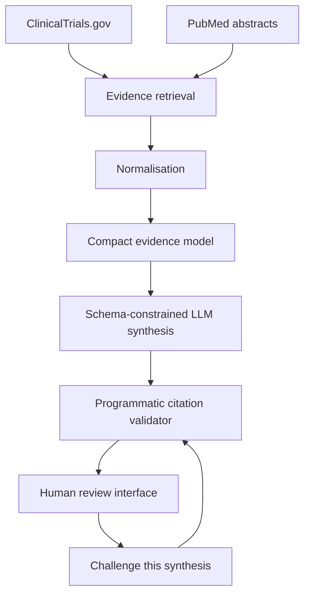

# TrialLens AI

TrialLens AI is an evidence-grounded drug-development decision workspace. It
retrieves live clinical-trial records from ClinicalTrials.gov and scientific
literature from PubMed, then presents a traceable evidence landscape for human
review.

## Live application

[Open TrialLens AI on GitHub Pages](https://fumad100.github.io/triallens-ai/)

## Features

- Search by drug or development asset, with an optional indication
- Live ClinicalTrials.gov and PubMed retrieval
- PubMed abstract and publication-type enrichment
- Citation-grounded AI evidence synthesis and critical challenge mode
- Evidence-maturity and decision-readiness summaries
- Trial and publication source links
- Human-review acknowledgement and downloadable evidence brief
- Dedicated How it works, Responsible AI, and New review pages

## Run locally

Node.js 22.13 or newer is required.

```bash
npm install
npm run dev
```

Then open the local URL printed in the terminal.

To enable the AI synthesis endpoint, copy `.env.example` to `.env.local` and
set `OPENAI_API_KEY`. The key is read only by `app/api/synthesis/route.ts`; it
must never be placed in `docs/` or any browser-delivered JavaScript.

## AI evidence synthesis

TrialLens passes only the records already retrieved from ClinicalTrials.gov and
PubMed to the model. The model cannot independently search for evidence.

- Output is constrained to a strict JSON schema.
- Every evidence finding must reference a retrieved NCT ID or PMID.
- Citation identifiers are validated programmatically before display.
- A second mode challenges the synthesis for unsupported assumptions,
  mismatches, immature evidence, missing comparators, and evidence gaps.
- The interface records an Accept, Amend, or Reject human-review decision.
- The grounding percentage verifies identifier membership, not whether a cited
  source semantically entails a generated claim.



## Validation

```bash
npm test
npm run lint
```

Groundedness fixtures live in `evaluation/cases.json`; citation and schema
tests live in `tests/synthesis.test.mjs`. API tests do not make paid model calls.

## GitHub Pages deployment

The independent static deployment is in `docs/`. It queries the public
ClinicalTrials.gov and PubMed APIs directly from the visitor's browser, so it
does not require a ChatGPT-hosted runtime or application server.

GitHub Pages cannot securely execute the AI synthesis endpoint because it is a
static host and cannot protect `OPENAI_API_KEY`. The live retrieval workspace
there remains functional; deploy the full TypeScript application to a
server-capable runtime to expose AI synthesis publicly.

## Responsible use

TrialLens AI is decision support, not medical advice or an autonomous clinical-
development decision maker. Registry status and publication volume do not by
themselves establish efficacy, safety, study quality, or benefit-risk.
